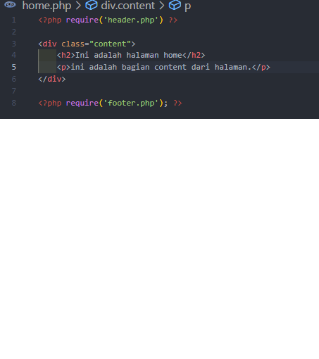
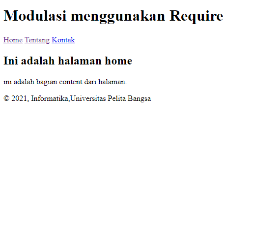

## nama     : Marlina Horo
## Nim      : 312010250
## kelas    : Ti 20 A2

1. membuat file dengan nama header.php

2. hasilnya

3. Membuat file dengan nama file footer.php

4. hasilnya

5. membuat file dengan nama home.php

6. hasilnya

## tugas

Pertanyaan dan Tugas

Implementasikan konsep modularisasi pada kode program praktikum 8 tentang
database, sehingga setiap halamannya memiliki template tampilan yang sama.

1. 

2.  

3.  

